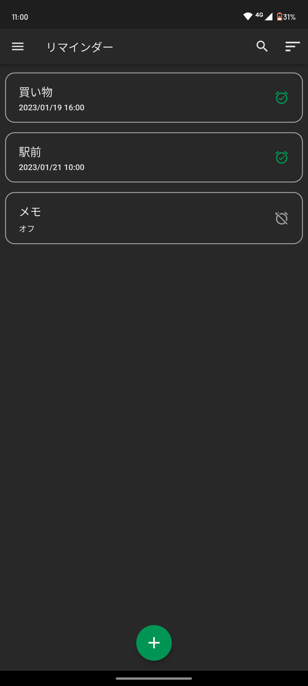
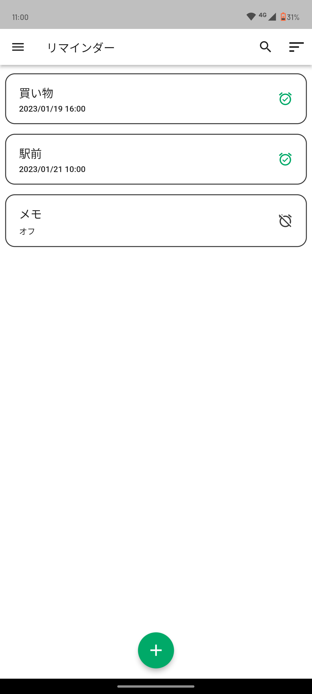

# Reminder

## このアプリについて

Reminderは好きな時間に通知を送信することができるため、大事なことを適切なタイミングで思い出すことができます。また、リマインダーの保存時にアラームをオフにすることで、メモとして活用することもできます。
設定ではアクセントカラーを自分好みに選ぶことができ、RGB値を変更することで完全オリジナルにカスタマイズができます。

 

## 機能
 - リマインダーの追加・編集・削除
 - スケジューリングされたリマインダーの追加
 - リマインダーのソート
 - リマインダーの検索
 - ゴミ箱
 - ゴミ箱の中身の自動削除
 - ダークテーマ
 - アクセントカラーのカスタマイズ

 

 

