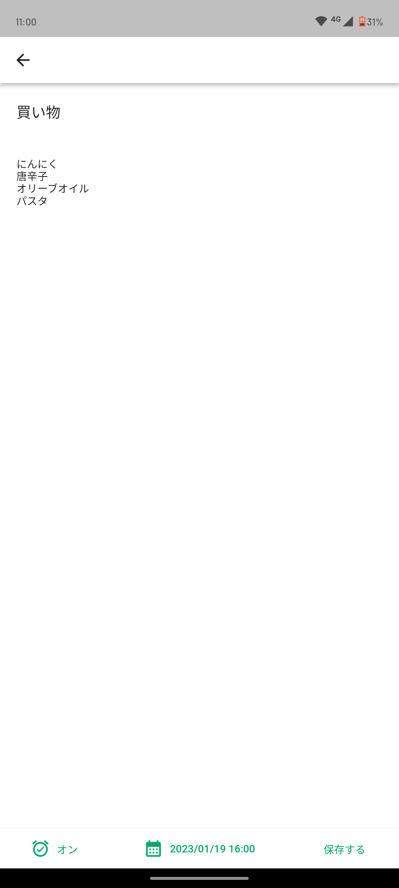
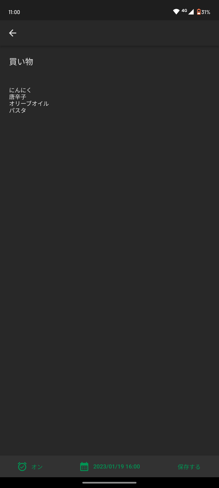
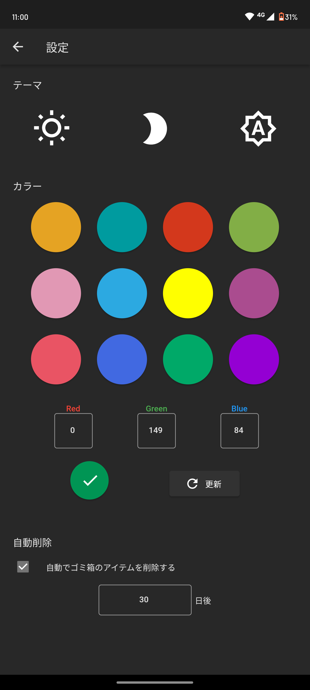

# Reminder

好きな時間にリマインダーを設定することで大事なことを思い出すことができる!
アラームのオンオフを切り替えることが出来るため、メモとして活用することも出来る。

設定画面のカラーピッカーを使うことで気分によって色を変更できる。
 
<dev style="display: flex;">

</dev>
<dev style="display: flex;">

</dev>
